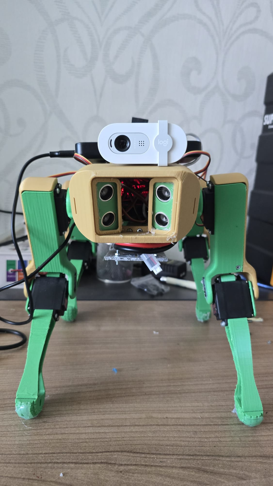

#  Budget SpotMicro ROS2
### AI-Assisted Search and Rescue Robot Dog — under $500

[](https://docs.ros.org/en/jazzy/)
[](https://www.raspberrypi.com/)
[](LICENSE)
[]()
[]()

<p align="center">
  
</p>

A low-cost quadruped robot built for Search and Rescue (SAR) operations. Based on the SpotMicro open hardware platform, modified to run on a Raspberry Pi 5 with dual PCA9685 servo controllers and ROS2 Jazzy. Capable of autonomous human detection via YOLOv26n, GPS location reporting, and offline operation over 1km range via LoRa radio — all for under $500.

> Built as a student robotics project by [roberenest](https://github.com/roberenest).  
> Based on [mogar/spot_micro](https://github.com/mogar/spot_micro) — modified for Raspberry Pi 5, dual PCA9685 boards, and ROS2 Jazzy.

---

##  Why this robot?

Traditional SAR tools struggle in disaster zones:
- **Drones** can't navigate inside collapsed buildings
- **Tracked robots** get stuck on rubble and stairs
- **Boston Dynamics Spot** costs ~$75,000

This robot walks on four legs, fits through tight spaces, climbs uneven terrain, detects humans with AI vision, and reports GPS coordinates back to an operator — all offline, all for under $500.

---

##  Features

- ✅ 12-servo quadruped walking with inverse kinematics (IK)
- ✅ YOLOv26n real-time human detection via onboard camera
- ✅ Keyboard and gamepad control
- ✅ Live video feed
- 🔧 LoRa radio communication (1km range) — in progress
- 🔧 GPS location reporting — in progress
- 🔧 Autonomous human detection alerts — in progress

---

<p align="center">
  
</p>

##  Hardware

| Component | Details |
|---|---|
| Computer | Raspberry Pi 5 (8GB RAM) |
| OS | Debian Trixie (aarch64) |
| Servo Controllers | 2x PCA9685 (front: 0x40, rear: 0x41) |
| Servos | 12x (3 per leg) |
| Camera | Logitech Brio 100 |
| Distance Sensor | HC-SR04 Ultrasonic |
| IMU | MPU6050 Gyroscope |
| Power | XL4016 power modules |
| Comms | LoRa radio (USB dongle) — WIP |
| GPS | USB GPS module — WIP |
| Frame | 3D printed SpotMicro body |

> **Note:** The LCD display and HC-SR04 ultrasonic sensor are not yet implemented. Running additional devices on the Raspberry Pi's I²C bus introduced reliability issues, so I am considering moving the LCD and ultrasonic sensor to a dedicated ESP32.

### Servo Channel Mapping

| Leg | Controller | Coxa | Hip | Knee |
|---|---|---|---|---|
| Front Left | PCA 0x40 | CH 8 | CH 7 | CH 15 |
| Front Right | PCA 0x40 | CH 5 | CH 3 | CH 0 |
| Back Left | PCA 0x41 | CH 14 | CH 7 | CH 11 |
| Back Right | PCA 0x41 | CH 15 | CH 0 | CH 9 |

---

##  Software Stack

- **ROS2 Jazzy** (running in Docker)
- **YOLOv26n** — human detection
- **Python** — control nodes
- **Docker** — containerized ROS2 environment

---

##  Getting Started

### Requirements
- Raspberry Pi 5 (8GB recommended)
- Docker installed
- I2C enabled (`raspi-config`)
- I2C speed set to 400kHz for reduced servo jitter — add this to `/boot/firmware/config.txt`:
  ```
  dtparam=i2c_arm_baudrate=400000
  ```

### Running the robot

**Automatic shell command** (in any terminal on the Pi):
```bash
~/spot_micro/launch_dog.sh
```

Alternatively, you can start it manually:

**Step 1 — Start the Docker container** (in any terminal on the Pi):
```bash
cd ~/spot_micro/docker-full && sudo docker compose up -d
```

**Step 2 — Get a shell inside the container:**
```bash
sudo docker exec -it docker-full-ros2-1 bash
```

**Step 3 — Launch the robot inside that shell:**
```bash
cd /home/ros/spot_ws && \
source /opt/ros/jazzy/setup.bash && \
source install/setup.bash && \
/home/ros/spot_ws/start.sh
```

The robot is now live. Use keyboard to control it.

## Running AI Human Detection

The YOLO pipeline runs independently from the ROS2 robot controller. It performs real-time human detection using the onboard camera, displays the live video stream, and sends a push notification whenever a person is detected.

Start it from the Raspberry Pi:

```bash
~/spot_micro/run_yolo.sh
```

The script will:

- Load the YOLOv26n model
- Open the USB camera
- Display a live annotated video stream
- Detect people in real time
- Send an ntfy notification when a person is detected
- Prevent repeated alerts using a 30-second cooldown

## Receiving Detection Alerts

This project uses **ntfy.sh** for push notifications.

### Subscribe from a phone

1. Install the **ntfy** app for Android or iOS.
2. Subscribe to the topic:

```
Spotmicro_sar
```

Whenever the robot detects a person, you'll receive a notification similar to:

```
Spotmicro_sar

Human detected
Confidence: 0.87
```

Notifications are rate-limited to one alert every 30 seconds to prevent spam.

## Calibrating your robot:

1. Use `cal_servo.py` to move each servo.
2. Physically adjust the robot into the correct neutral standing pose.
3. Measure the required servo positions.
4. Convert the measured positions into the raw PCA9685 servo values.
5. Update the values in:
`spot_ws/src/joint_ctl/joint_ctl/lib/spot_joints.py`.
6. Rebuild the ROS2 workspace.

These raw values are treated as the robot's 0° reference position for inverse kinematics and movement commands.

Here is the code required for running `cal_servo.py`:
```

cd /home/ros/spot_ws
source /opt/ros/jazzy/setup.bash
source install/setup.bash
python3 src/joint_ctl/joint_ctl/lib/cal_servo.py
```
Commands for rebuilding ros2 workspace:
```
colcon build --symlink-install
source install/setup.bash
```
## Current Servo Calibration Values

These are the currently tuned values for **my robot**. Your robot will likely require different values due to differences in servo alignment, 3D printed parts, assembly tolerances, and hardware variations.

You can calibrate your robot using `cal_servo.py`, as mentioned above. After finding the correct offsets, apply the values while the robot is standing in the neutral/middle position.
```
flc=302, flh=341, flk=375(inv)
frc=295, frh=245(inv), frk=360
blc=323, blh=430(inv), blk=289(inv)
brc=285, brh=241(inv), brk=309
```

To recalibrate: use the Adafruit PCA9685 library to get raw PWM values, then convert with `raw_pwm / 16` to get the `zero_count` format used by this codebase.

---

##  Repository Structure

```
spot_micro/
├── docker-full/                  # Docker environment for ROS2 Jazzy
│   ├── docker-compose.yml
│   ├── Dockerfile
│   └── ...
│
├── spot_ws/                      # ROS2 workspace
│   ├── src/
│   │   ├── commanding/           # Keyboard and gamepad control
│   │   ├── joint_ctl/            # Servo control and calibration
│   │   │   └── joint_ctl/
│   │   │       └── lib/
│   │   │           ├── cal_servo.py      # Servo calibration utility
│   │   │           ├── servo.py          # PCA9685 servo driver
│   │   │           └── spot_joints.py    # Servo mapping & zero positions
│   │   └── motion_control/       # Inverse kinematics and gait generation
│   │
│   ├── start.sh                  # Launches the ROS2 robot stack
│   ├── build/                    # Generated by colcon
│   ├── install/                  # Generated by colcon
│   └── log/                      # Build/runtime logs
│
├── yolo/                         # AI human detection environment
│   ├── bin/                      # Python virtual environment
│   ├── detect.py                 # YOLOv26n human detection + ntfy alerts
│   ├── yolo26n.pt                # YOLOv26n model
│   └── ...
│
├── launch_dog.sh                 # Starts Docker and launches the robot
├── run_yolo.sh                   # Starts the YOLO detection pipeline
│
├── README.md
├── LICENSE
└── .gitignore
```

---

##  Roadmap

- [x] Walking with IK gait
- [x] YOLOv26n human detection
- [x] Keyboard and gamepad control
- [x] Live video feed
- [x]Push notifications via ntfy.sh when a person is detected
- [ ] LoRa offline communication
- [ ] GPS location reporting
- [ ] Microphone for audio survivor detection
- [ ] Autonomous navigation

---

##  Credits

- [mogar/spot_micro](https://github.com/mogar/spot_micro) — original ROS2 SpotMicro codebase this project is built on
- [SpotMicro community](https://github.com/topics/spotmicro) — open hardware platform

---

## 📄 License

MIT License — see [LICENSE](LICENSE) for details.
